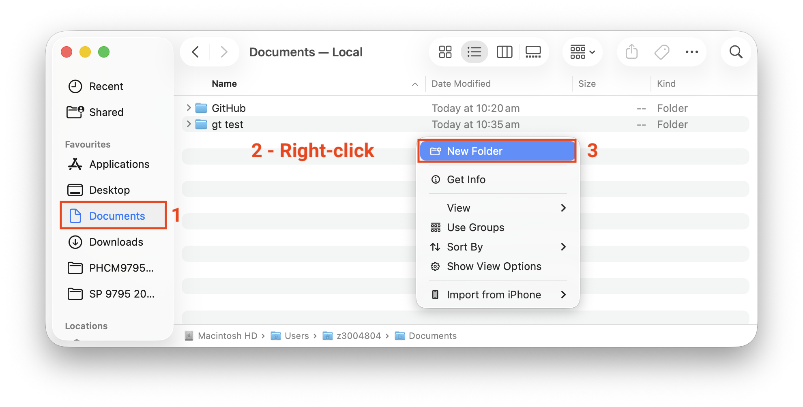
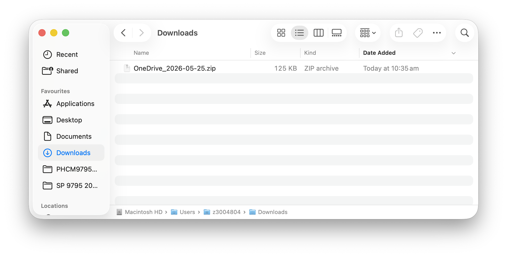
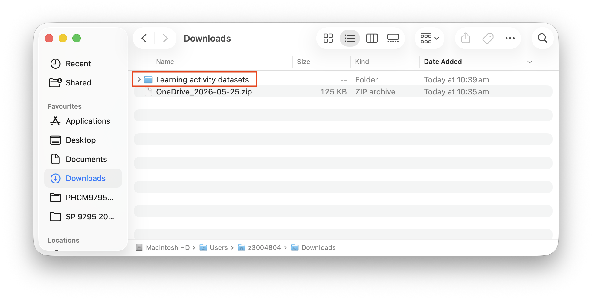

1. I recommend storing all course materials in a single folder. Here, I will create a new folder called **Foundations of Biostatistics** in my **Documents** folder. Navigate to the **Documents** folder using the **Finder**. [Right-click](https://www.macworld.com/article/671652/how-to-right-click-on-a-mac.html) in an empty part of the Documents folder and choose **New Folder**:

[Rename](https://support.apple.com/en-au/guide/mac-help/mchlp1144/mac) the new folder **Foundations of Biostatistics**.

2. In your browser, locate the [PHCM9795 Course Materials](https://unsw.sharepoint.com/sites/CLS-PHCM9795_T2_5266_Combine/SitePages/Home.aspx#course-materials) section:

3. Hover your mouse over the folder you want to download, and click the three dots. Choose **Download** Here I have chosen to download the "Learning activity datasets":

{width="50%"}

3. Depending on your browser, you may be asked where to save the downloaded file, or it will be saved in your **Downloads** folder. The saved file will be a compressed file, called something like "OneDrive_2026...". Using the **Finder**, navigate to the **Downloads** folder (or the folder you have saved your data into):

{width="75%"}

4. Double-click the file to extract the contents, and the downloaded folder of data will appear:

{width="75%"}

5. [Move the folder](https://support.apple.com/en-au/guide/mac-help/mh26885/mac) `Learning activity datasets` into your **Foundations of Biostatistics** folder created in Step 1.