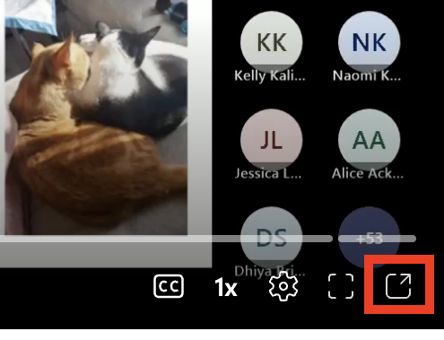
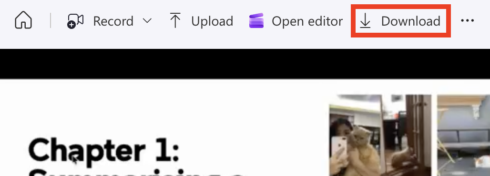

1. Navigate to the [PHCM9795 Course Recordings](https://unsw.sharepoint.com/sites/CLS-PHCM9795_T2_5266_Combine/SitePages/Home.aspx#course-recordings)

2. Click the video you want to download, and it will start playing. While it is playing, click this icon in the bottom-right of the video player:

3. The video will open in Microsoft Stream. Click the **Download** icon at the top of the video, and your video will begin downloading.

