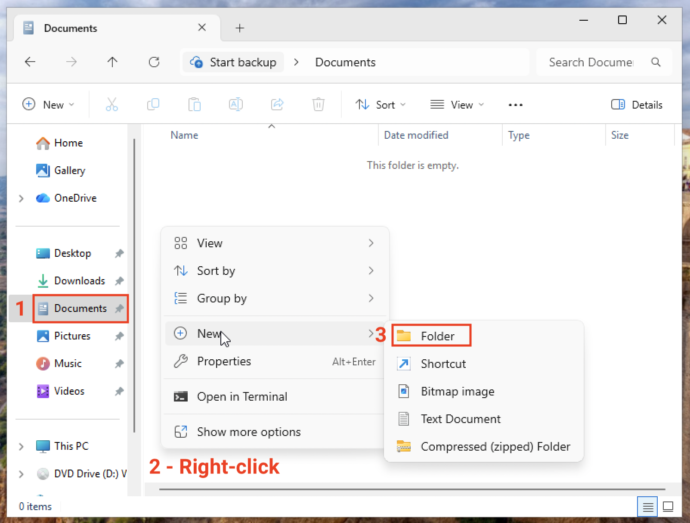
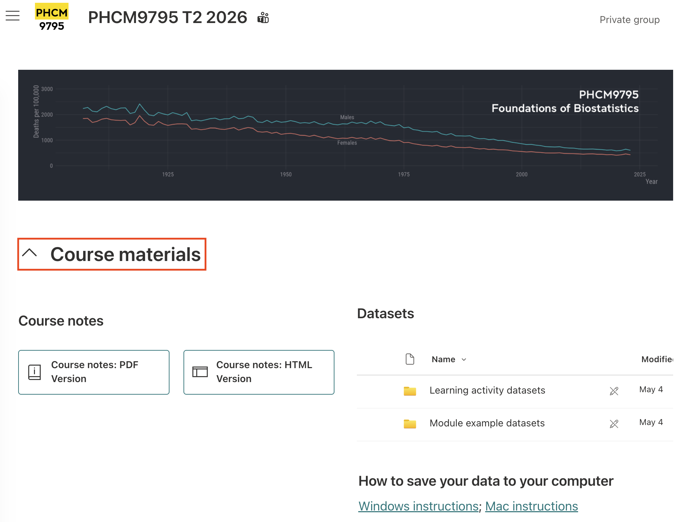
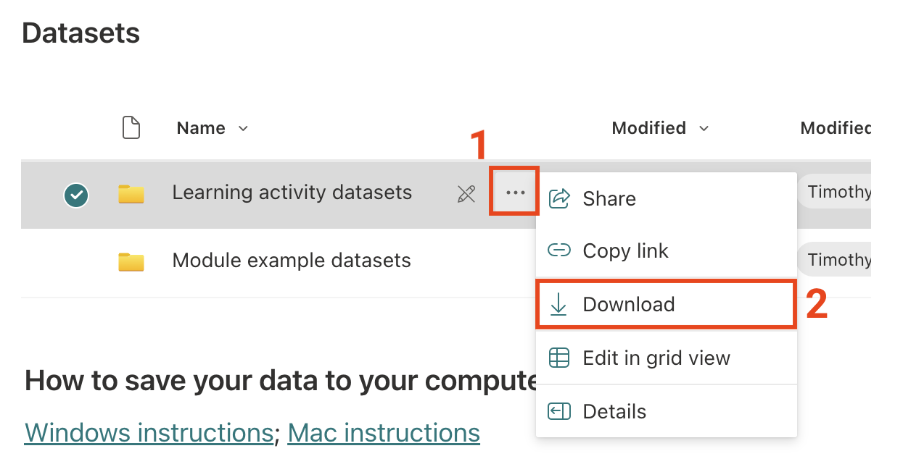
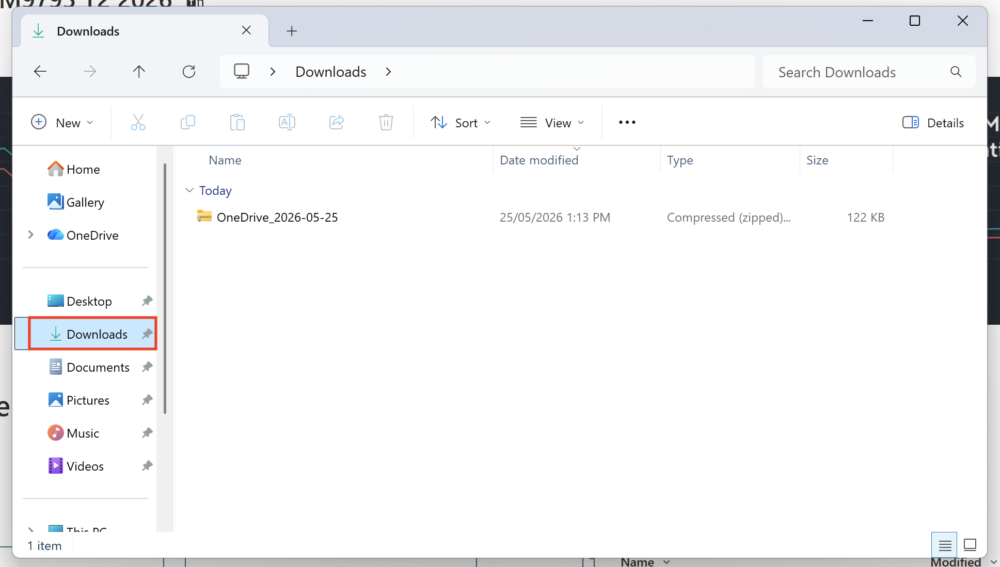
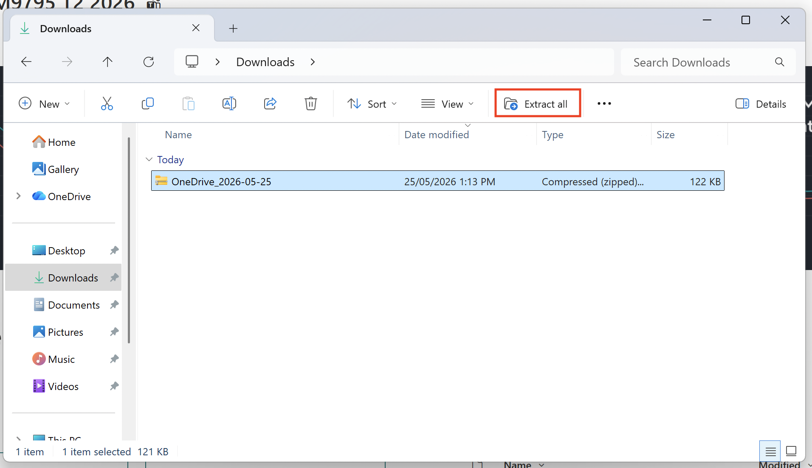
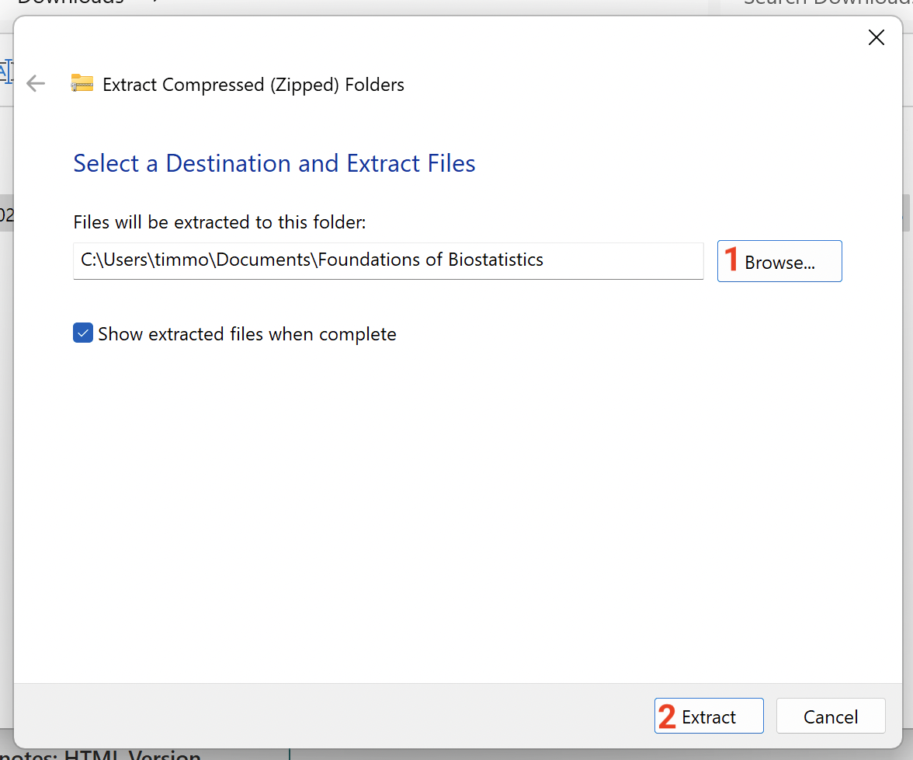
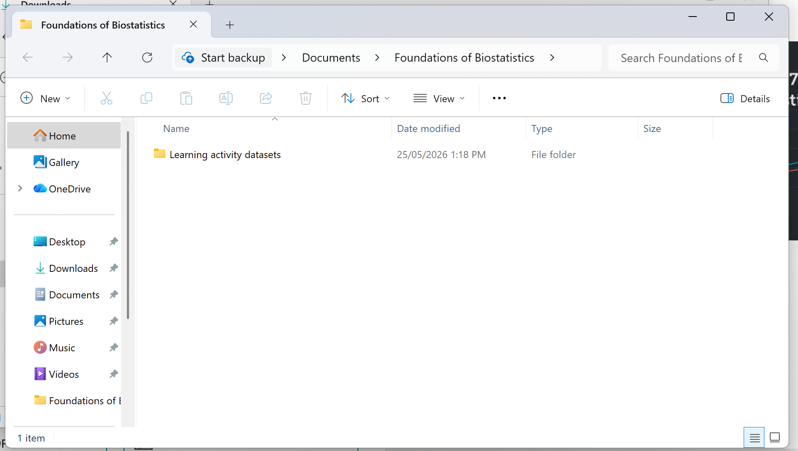

1. I recommend storing all course materials in a single folder. Here, I will create a new folder called **Foundations of Biostatistics** in my **Documents** folder. Navigate to the **Documents** folder using **Windows Explorer**. [Right-click](https://www.howtogeek.com/747755/how-to-right-click/) in an empty part of the Documents folder and choose **New > Folder**:

[Rename](https://www.teachucomp.com/how-to-rename-files-and-folders-in-windows-11-instructions/) the new folder **Foundations of Biostatistics**.

2. In your browser, locate the [PHCM9795 Course Materials](https://unsw.sharepoint.com/sites/CLS-PHCM9795_T2_5266_Combine/SitePages/Home.aspx#course-materials) section:

3. Hover your mouse over the folder you want to download, and click the three dots. Choose **Download** Here I have chosen to download the "Learning activity datasets":

{width="50%"}

4. Depending on your browser, you may be asked where to save the downloaded file, or it will be saved in your **Downloads** folder. The saved file will be a compressed file, called something like "OneDrive_2026...". Using **Windows Explorer**, navigate to the **Downloads** folder (or the folder you have saved your data into):

{width="75%"}

5. Click the file once, and then click **Extract all** at the top of the window:

{width="75%"}

6. Click **Browse** and browse to the **Foundations of Biostatistics** folder. Click **Extract**:

{width="75%"}

7. The downloaded folder of data will appear:

8. You can safely delete the file called "OneDrive_2026..." from your **Downloads** folder.
